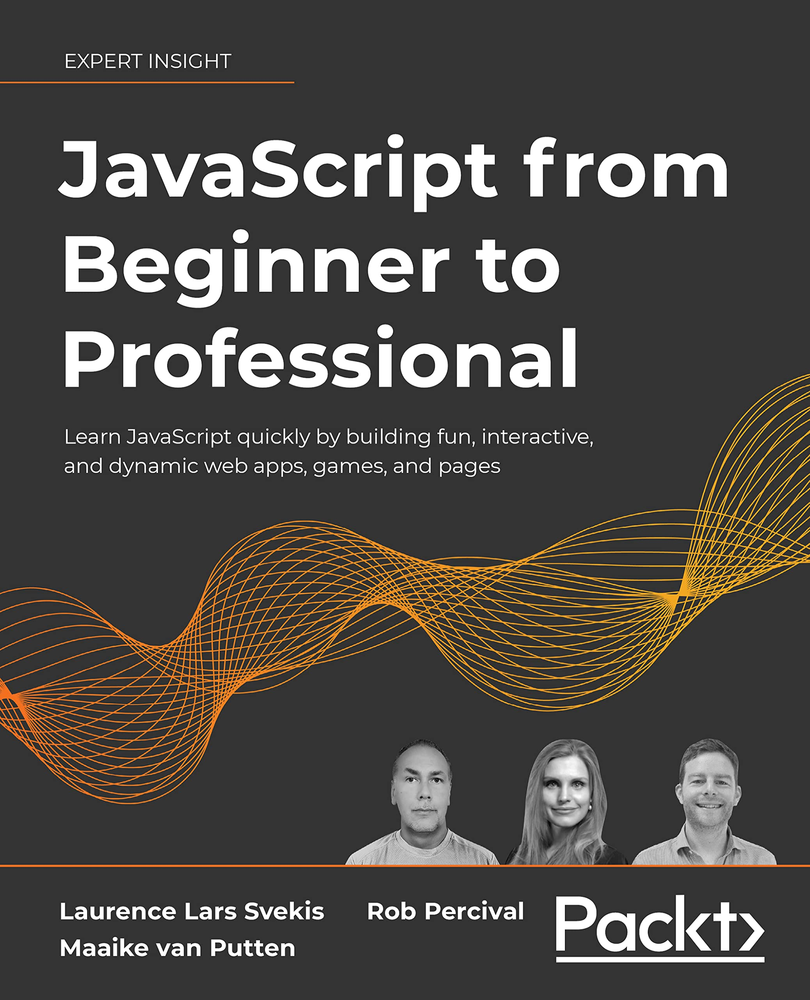

    <h1> Javascript-practice</h1>
    
Personal space for practicing javascript with projects and code-snippets.

## Status 📊

    <h3>06.June 2024</h3>
    
     
     
    
📙 Currently following the projects and exercises found in "Javascript from beginner to professional" by: 
    Laurence Lars Svekis, Rob Percival and Maaike van Putten.

